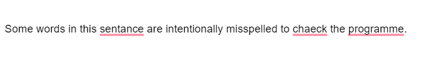
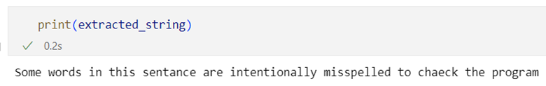
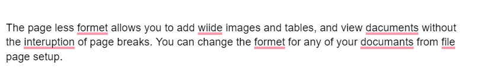
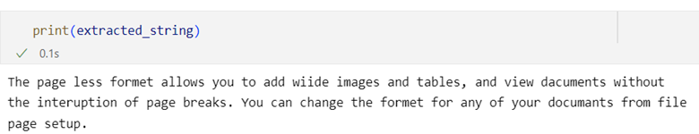
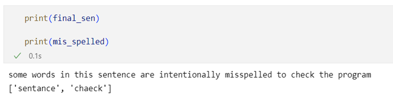
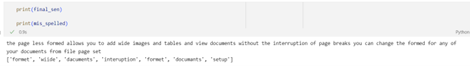

## OCR spell check

**1. OCR (Optical Character Recognition)** <br/>
Used the tesseract library to extract characters from the image.

```
import pytesseract

pytesseract.pytesseract.tesseract_cmd = 'C:/Program Files/Tesseract-OCR/tesseract.exe'
```

* Extracted sentences from the image<br/>
<br/>
<br/>

<br/>
<br/>

**2. Spell Checker** <br/>
Used the textblob library to track existing words. <br/>
From the extracted sentence, I did some preprocessing work to remove unnecessary characters like punctuation, numbers, etc. <br/>

```
TAG_RE = re.compile(r'<[^>]+>')

def remove_tags(text):
    return TAG_RE.sub('', text)

def preprocess_text(sen):
  # Removing html tags
  sentence = remove_tags(sen)
  # Remove punctuations and numbers
  sentence = re.sub('[^a-zA-Z]', ' ', sentence)
  # Single character removal
  sentence = re.sub(r"\s+[a-zA-Z]\s+", ' ', sentence)
  # Removing multiple spaces
  sentence = re.sub(r'\s+', ' ', sentence)
  return sentence
```

After the pre-processing step, I used the spellcheck() function from the textblob to check the spelling of each word from the sentence.<br/>

```
def spell_check(word):
  word = Word(word)
  result = word.spellcheck()
  
  if word == result[0][0]:
    return word, True
  else:
    return result[0][0], False

def spell_check_for_sentence(extracted_string):
  extracted_string = preprocess_text(extracted_string)
  sentence = extracted_string.split(" ")
  sentence = [word.lower() for word in sentence]
  
  checked = []
  mis_spelled = []
  for word in sentence:
    if word != '':
      w, val = spell_check(word)
      checked.append(w)
      if val == False:
        mis_spelled.append(word)

  
  checked_sentence = ' '.join(checked)
  return checked_sentence, mis_spelled
```

* For the ‘incorrect1.png’ image, the word sentence and check were misspelled. <br/>
<br/>
*For the ‘incorrect2.png’ image, the word format, wide, documents, interruption, and set up were misspelled. <br/>
<br/>


